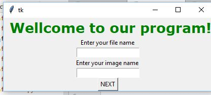
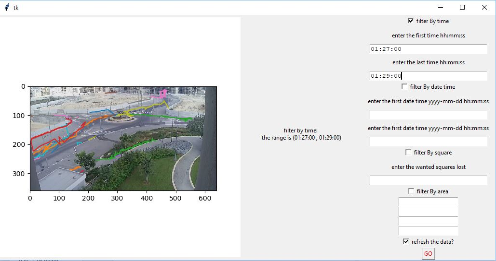

# paths 

* Orly Kierszenbaum
* Chani Frenkel
* Elisheva Shmuel

## How to Run This program

## Screenshots 

## How to Run This Program

* run: main.py file
* start: enter file name and image name
* choose the filter and fill in details
* check if you want to refresh the data
* uncheck the filter cheack box if you want to cancel them.

### Prerequisites
* Python 3.7
* pipenv
* pandas
* numpy
* tkinter
* matplotlib

